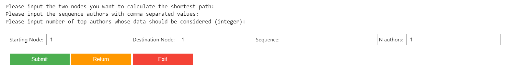

# ADM-HW4

## Team members
* Camilla Brigandi - 2055650
* Stefano Rinaldi - 1945551
* 
*

This repository contains the submission of Group #9 of the fifth homework for the course "Algorithmic Methods of Data Mining", Academic year 2023–2024.

## Contents

* __`main.ipynb`__: the main notebook files. It contains all the answers and all the cells are already executed.
* __`CLQ-Screenshot.png`__: screenshot of the execution of the command-line question
* __`CommandLine.sh`__: command-line question script

## Visualisation System

The Visualisation System in task 2 is meant to be interactive with the user. Since the cells are already executed, here we plot some examples of how the system is structured. if you want to have a full experience of it, you have to download the __`main.ipynb`__ file and execute the cells. Please, note that some of them may need couple of minutes to execute due to the large amount of data.

### System 1
Here you are able to see how system 1 is structured with all the pages and possible options:
So we stert with the homepage, then the user has to choose the graph and lastly they will select the features they want to investigate.

    
    
    
    

### System 2
Here you are able to see how system 2 is structured with all the pages and possible options:
The system is identical to the previous one except for the fact that after a user has selected the graph, they will be required to input the node of interest.

### System 3
Here you are able to see how system 3 is structured with all the pages and possible options:
The system is identical to the previous one except for the fact that after a user has selected the graph, they will be required to input all the variable of interest.

