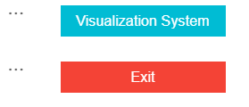
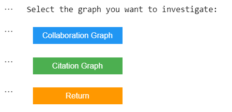
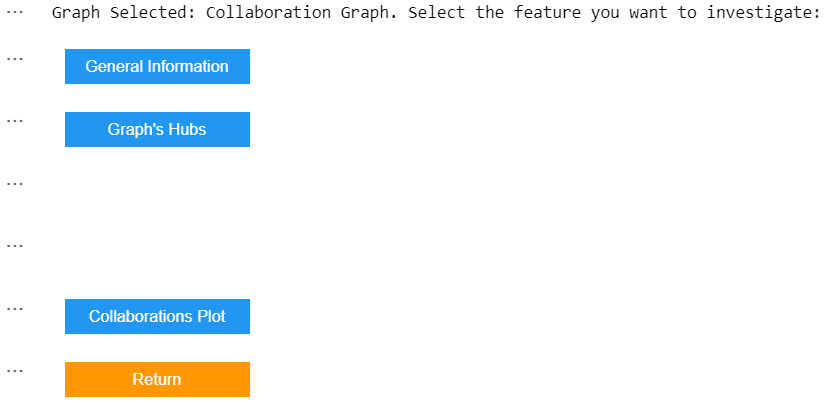
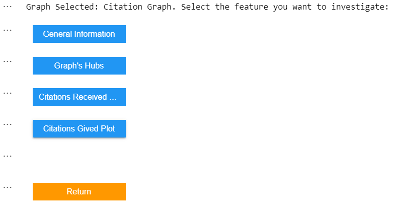
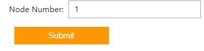

# ADM-HW4

## Team members
* Camilla Brigandi - 2055650
* Stefano Rinaldi - 1945551
* 
*

This repository contains the submission of Group #9 of the fifth homework for the course "Algorithmic Methods of Data Mining", Academic year 2023–2024.

## Contents

* __`main.ipynb`__: the main notebook files. It contains all the answers and all the cells are already executed.
* __`CLQ-Screenshot.png`__: screenshot of the execution of the command-line question
* __`CommandLine.sh`__: command-line question script

## Visualisation System

The Visualisation System in task 2 is meant to be interactive with the user. Since the cells are already executed, here we plot some examples of how the system is structured. if you want to have a full experience of it, you have to download the __`main.ipynb`__ file and execute the cells. Please, note that some of them may need coupple of minutes to execute due to the large amount of data.

<code style="background:red;color:black">**System 1:**</code>  
Here you are able to see how system 1 is structured with all the pages and possible options:
So we stert with the homepage, then the user has to choose the graph and lastly they will select the features they want to investigate.

    
    
    
    

<code style="background:red;color:black">**System 2:**</code>  

    

        
        
<strong>Here the user has to input the node</strong>

    

<code style="background:red;color:black">**System 3:**</code>  
